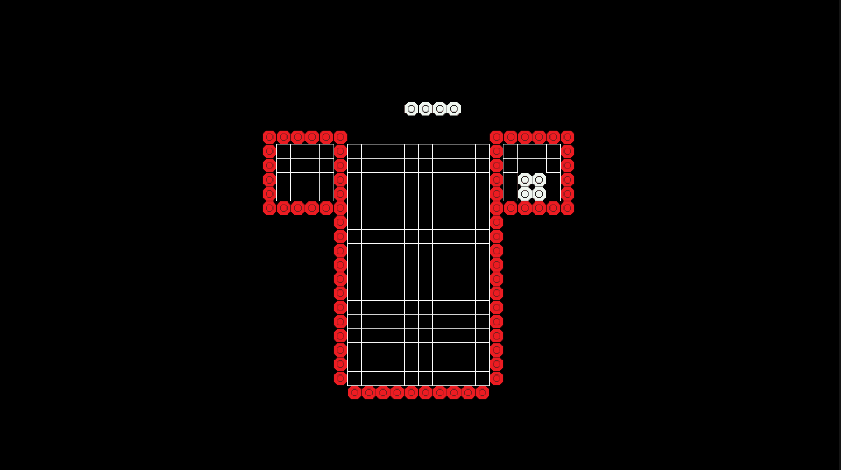
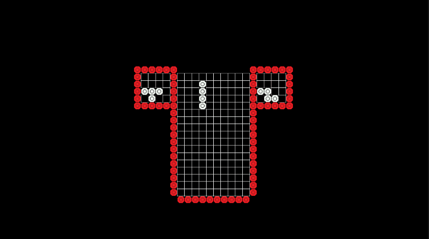

  

 
 
 

 Yet another Tetris clone made in Unity.
 
 Implements wallkicks and abides by the [SRS](https://tetris.fandom.com/wiki/SRS) standard.
 
 Art made in Aseprite.
 
 # Holding
 
 
  # Wallkicks
 
 
  # Sample Gameplay
 
